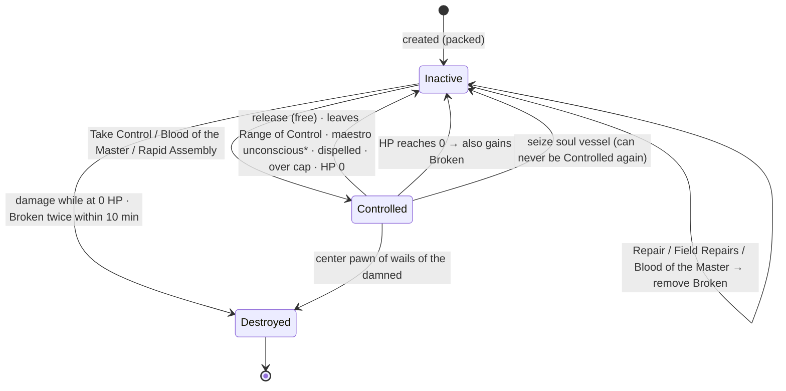

# Maestro for Foundry VTT — Implementation Design

**Module:** `pf2e-maestro` · **Design doc version:** 1.0 (2026-09-16)
**Rules source:** *Maestro* Document Version Beta v2.1 / Playtest Version v1.0, by Erik (Lucky Thirteen)
**Canonical rules text:** [`docs/maestro-rules-v2.1.md`](maestro-rules-v2.1.md) (verbatim transcription of the PDF)
**Targets:** Foundry VTT **v14** (minimum 14.361, verified 14.367) · PF2e system **8.5.x**

This document is written for Claude Code. It explains what to build, how the pieces fit together, which parts are automated and which are left to the player, and in what order to build them. Rules text lives in the companion rules file, and item descriptions must be copied from there word for word.

---

## 0. Ground rules for the implementer

1. **Rules come from the rules file.** Don't change a number, trait, level, or wording. If the rules are silent or contradict themselves, use the default in §11 and add a `// RULES-QUESTION(#n)` comment that references the question number. Don't invent a new mechanic.
2. **Use the PF2e system first.** Before writing code, check whether a rule element (RE) or an existing core item already handles the job. Write module code only for what REs can't express: cross-actor state, token geometry, and lifecycle.
3. **Verify system APIs against the installed source.** PF2e changes quickly. Every API marked **(verify)** below comes from documentation or memory, not from running code. Check it against `systems/pf2e` or the `v14-dev` branch before relying on it. If it's wrong, update this document in the same commit.
4. **Keep rules logic pure.** Every formula (pawn stats, pawn cap, range, DCs, damage scaling) lives in `src/rules/` as a pure function with unit tests. Foundry glue calls those functions and never duplicates the math.
5. **Keep IDs stable.** Every compendium document has a fixed 16-character `_id` in its source JSON, so `Compendium.pf2e-maestro.<pack>.Item.<id>` UUIDs never change. `GrantItem` REs and code depend on them.
6. **Stay small.** Ship one milestone at a time (§9) with its acceptance checks passing. Don't start the next milestone early.

---

## 1. Scope

**In scope:** the full Maestro class as written in v2.1. That covers the class item, all class features, four Crafts, 42 class feats, 10 command spells (plus the core spells that feats grant), pawns as actors, and the automation described in §5.

**Out of scope for v1:**

- Enforcing the shared action economy.
- Automatically combining damage from separate Strikes for resistances and weaknesses.
- Resolving Pyrrhic Defense, Lay Bare, and Fate's Embrace outcomes automatically.
- Automating movement in formations.
- Enforcing Puppet's Curse control.

Each of these gets a chat card that states the rule. Players and the GM resolve it.

### 1.1 Dependencies

| Package | Role | Required? |
|---|---|---|
| `pf2e` ≥ 8.5.0 | System | **Required** |
| `lib-wrapper` | Only if a system method must be wrapped (for example, Group Tactics fallback C in §5.6) | Optional; add only when needed |
| `sequencer` (+ free JB2A assets) | Tether visuals between the maestro and pawns | Optional; soft integration |
| `pf2e-toolbelt` | "Shared Data" can share runes, skills, and turn events | Optional; supported as an alternative (see D3) |
| `portal-lib` | Crosshair placement when spawning pawns | Optional; fall back to a click-to-place prompt |

Integrations with optional packages must check `game.modules.get(id)?.active` and degrade gracefully when the package is missing.

---

## 2. Rules digest (numbers the code must reproduce)

### 2.1 Maestro (class item)

| Field | Value |
|---|---|
| Key attribute | Int |
| HP per level | 8 |
| Perception | Expert (1) → Master at 9 |
| Fortitude / Reflex / Will | Trained / Expert / Expert. Fort → Expert at 3. Ref → Master at 7, Legendary at 13. Will → Master at 15 |
| Skills | Trained in Crafting, plus 1 from Craft, plus 2 + Int additional |
| Attacks | Simple, martial, unarmed: Trained → Expert at 5 → Master at 13 |
| Defenses | Light, unarmored: Trained → Expert at 11 → Master at 19 |
| Class DC | Trained → Expert at 9 → Master at 17 |
| Spellcasting (command spells) | Trained → Expert at 9 (Maestro's Expertise) → Master at 17 (Maestro's Mastery), both only if you have command spells. Resolved by Q1 |
| Class feats | 1, 2, 4, 6, …, 20 |
| Skill feats | 2, 4, …, 20 |
| General feats | 3, 7, 11, 15, 19 |
| Ancestry feats | 1, 5, 9, 13, 17 |
| Skill increases | 3, 5, 7, …, 19 |

### 2.2 Pawn math

Pawns derive their stats from the maestro. `I` = maestro's Int modifier, `L` = maestro's level.

| Stat | Formula |
|---|---|
| Level | `L` |
| Str / Dex / Con | `floor(I/2)`. Manual Might (both hands free) sets Str and Dex to `I`. Medium and Large pawns set Con to `I` |
| Int / Wis / Cha | Maestro's modifiers |
| HP | `10 + (4 + Con) × L`. Flesh (5th) adds `3 × L`. Large uses `10 + (6 + Con) × L` |
| AC | `10 + unarmored prof + item bonus`. Item bonus = `I + armor potency` (+1 for Metal pawns). Dex cap +0 |
| Unarmored prof | Trained; Expert at 11; Master at 19 |
| Unarmed attack prof | Trained; Expert at 5; Master at 13 |
| Strike attack attribute | Best of Str, Dex, and **Int** (Int always qualifies). Damage still uses Str per normal rules |
| Saves | Expert in all three (never improves) + Con / Dex / Wis |
| Perception | Trained + Wis (pawns use the maestro's senses; §5.9) |
| Skills | Maestro's proficiency ranks, plus item bonuses from items the maestro has invested |
| Speed | 25 ft (Wood pawns +5 to all Speeds) |
| Size | Small. Medium with Bigger Figures (2× Bulk). Large with Supersized (6× Bulk, +5 ft reach, counts as 2 pawns) |
| Bulk (Inactive) | 1 (Ethereal and Wood: 5 L). Medium ×2, Large ×6. Folded (Creative Discretion): halved, rounded down to the nearest L |
| Traits | construct, mindless, pawn (+ element traits for Elemental pawns) |
| Immunities | bleed, death effects, disease, healing, nonlethal attacks, poison, vitality, void, doomed, drained, fatigued, paralyzed, sickened, unconscious, mental |
| Controlled cap | 2 at levels 1–4, 3 at 5–8, 4 at 9–12, 5 at 13+ (Large pawns count as 2) |
| Range of Control | 30 ft emanation. +30 with Expanded Control (feat 4). +30 with Superior Control (feat 12) |
| Counteract | DC = maestro's class DC. Rank = `floor(L/2)` |

### 2.3 Worked examples (acceptance fixtures)

All examples use a Small, non-Flesh pawn with no runes, and the maestro's attribute boosts are applied on schedule. Encode these as unit tests (`src/rules/pawn-stats.test.js`) and use them in the in-Foundry smoke tests.

| Case | L | I | Wis | Str/Dex/Con | HP | AC | Unarmed atk | Fort/Ref | Will | Perc | Maestro class DC |
|---|---|---|---|---|---|---|---|---|---|---|---|
| A | 1 | +4 | +1 | +2 | 16 | 17 | +7 | +7 | +6 | +4 | 17 |
| B | 5 | +4 | +1 | +2 | 40 | 21 | +13 | +11 | +10 | +8 | 21 |
| C | 10 | +5 | +2 | +2 | 70 | 27 | +19 | +16 | +16 | +14 | 29 |
| D | 20 | +6 | +3 | +3 | 150 | 42 (45 with +3 armor potency) | +32 | +27 | +27 | +25 | 42 |

Extra fixtures:

- **E:** case C as a Flesh pawn has 100 HP.
- **F:** L12, I +5, Supersized (Large, Con +5) has `10 + 11×12 = 142` HP.
- **G:** case B with Manual Might active has Str/Dex +4. The attack is still +13, because Int is +4 either way.

### 2.4 Crafts at a glance

| Craft | Skill | Tradition | Base Strike(s) | 5th | 11th | 17th |
|---|---|---|---|---|---|---|
| Flesh | Medicine | Occult | rancid bite 1d8 poison (brawling; deadly d8, finesse, grapple, poison, unarmed; on a crit, 1d4 persistent poison per weapon die) | Connective Tissue (+3 HP/level) | Putrid Pins ◆◆ (pawn action) | *blood of the master* ◆ (Focus 9) |
| Ethereal | Arcana | Arcane | Attack form: force bolt 1d6 force, max range 40 ft (sling; agile, magical, unarmed). Defense form: force bash 1d6 force (shield; finesse, forceful, parry, unarmed) | Greater Form: Warp Strike ◆◆ / Shield Barrier ◆ | Resonant Form | *spatial surge* ◆◆ (Focus 9) |
| Elemental | Nature | Primal | elemental blow 1d6 (brawling; finesse, forceful, unarmed, versatile B) and elemental shot 1d6, max range 20 ft (sling; unarmed). Damage type = magical element; both get the element's trait | *elemental font* ◆◆ (Focus 3) | Elemental Warding | Elemental Avatar |
| Sympathetic | Religion or Occultism | Divine | steal essence 1d8 spirit (brawling; agile, finesse, spirit, unarmed; applies fatebound) | *puppet's curse* ◆◆ (Focus 3) | Fate's Embrace ⟳ | Master of Souls (*wails of the damned*, *seize soul*) |

**Elemental pawn choices, made at creation:**

- **Physical element:** wood (trait wood), stone (trait earth), or metal (trait metal).
- **Magical element:** fire (trait fire), cold (trait water), or electricity (trait air).

**Solid Body effects by physical element:**

- **Wood:** 5 L Bulk and +5 ft to all Speeds.
- **Stone:** resistance to physical damage equal to `1 + floor(L/2)`.
- **Metal:** elemental blow gains parry, and the AC item bonus increases by 1.

### 2.5 Command spells

| Spell | Source | Actions | Rank label | Pool |
|---|---|---|---|---|
| *telekinetic projectile*, *telekinetic hand* (core, as focus cantrips) | Wires on the Wind (feat 1) | core | cantrip | no |
| *rapid assembly* | Second String (feat 4) | ◆◆ | 2 | +1 |
| *elemental font* | Elemental Craft 5 | ◆◆ | 3 | +1 |
| *puppet's curse* | Sympathetic Craft 5 | ◆◆ | 3 | +1 |
| *sacrifice pawn* | Sacrifice Pawn (feat 6) | ◆◆ | 3 | +1 |
| *project senses* | Project Senses (feat 8) | ◆◆ | 4 | +1 |
| *hold together* | Master's Will (feat 10) | ◆◆ | 5 | +1 |
| *blood of the master* | Flesh Craft 17 | ◆ | 9 | +1 |
| *spatial surge* | Ethereal Craft 17 | ◆◆ | 9 | +1 |
| *wails of the damned*, *seize soul* (core, as 9th-rank command spells) | Sympathetic Craft 17 | core | 9 | +1 (once for both) |
| *blitz* | Dextrous Mind (feat 18) | ◆◆ | 9 | +1 |

The focus pool maximum is capped at 3 by the system. Command spells auto-heighten to `ceil(L/2)`.

---

## 3. Architecture

### 3.1 Repository layout

```
pf2e-maestro/
├── module.json
├── package.json                  # scripts: build, pack, unpack, test, lint, release
├── CLAUDE.md                     # implementer guide (short; points here)
├── docs/
│   ├── DESIGN.md                 # this file
│   └── maestro-rules-v2.1.md     # canonical rules text
├── src/
│   ├── module.js                 # entry: hooks registration only
│   ├── config.js                 # MODULE_ID, slugs, flag keys, setting keys
│   ├── rules/                    # PURE functions + tests (no Foundry globals)
│   │   ├── pawn-stats.js         # §2.2 formulas
│   │   ├── progression.js        # caps, ranges, DC-by-level, damage scaling
│   │   └── *.test.js             # Vitest
│   ├── link/                     # maestro ⇄ pawn binding and projection (§4)
│   │   ├── link-service.js
│   │   ├── projection.js         # builds the generated "Maestro Link" item on pawns
│   │   └── feature-map.js        # maestro feature slug → pawn-side items/REs
│   ├── pawns/
│   │   ├── lifecycle.js          # Controlled / Inactive / Broken / Destroyed state machine
│   │   ├── create-pawn.js        # creation wizard (downtime)
│   │   ├── packing.js            # "packed pawn" inventory item ⇄ token
│   │   ├── range.js              # Range of Control watcher
│   │   └── schematics.js         # install/remove, slot limits
│   ├── actions/                  # chat-card handlers: take-control, formations, craft actions
│   ├── spells/                   # focus-entry management, spell side effects
│   ├── ui/                       # dialogs (ApplicationV2), sheet header buttons, HUD
│   ├── integrations/             # sequencer.js, toolbelt.js, portal.js (all optional)
│   └── api.js                    # game.modules.get(MODULE_ID).api
├── packs/_source/<pack>/*.json   # human-editable documents (JSON), compiled to packs/<pack>
├── lang/en.json
├── styles/maestro.css
├── assets/icons/…                # SVG/WebP only
└── tests/foundry/                # in-Foundry smoke tests (Quench if available; else macro runner)
```

**Language: plain ESM JavaScript with JSDoc** (`// @ts-check` where it helps). PF2e doesn't publish type definitions, so TypeScript would mostly add `any`. Bundle with **esbuild** into `dist/module.js`. Unit tests use **Vitest** and cover `src/rules/` and `src/link/projection.js` only; these files must not import Foundry globals. Compile compendia with the official `@foundryvtt/foundryvtt-cli` (`fvtt package pack` / `unpack`, or its `compilePack` / `extractPack` JS API) into LevelDB `packs/`.

### 3.2 `module.json` essentials

```json
{
  "id": "pf2e-maestro",
  "title": "Maestro (PF2e Homebrew Class)",
  "compatibility": { "minimum": "14.361", "verified": "14.367" },
  "relationships": {
    "systems": [{ "id": "pf2e", "type": "system", "compatibility": { "minimum": "8.5.0" } }],
    "recommends": [
      { "id": "sequencer", "type": "module" },
      { "id": "pf2e-toolbelt", "type": "module" }
    ]
  },
  "esmodules": ["dist/module.js"],
  "styles": ["styles/maestro.css"],
  "languages": [{ "lang": "en", "name": "English", "path": "lang/en.json" }],
  "packs": [
    { "name": "maestro-class",         "label": "Maestro: Class",           "type": "Item",  "system": "pf2e", "ownership": { "PLAYER": "OBSERVER", "ASSISTANT": "OWNER" } },
    { "name": "maestro-features",      "label": "Maestro: Class Features",  "type": "Item",  "system": "pf2e" },
    { "name": "maestro-feats",         "label": "Maestro: Feats",           "type": "Item",  "system": "pf2e" },
    { "name": "maestro-actions",       "label": "Maestro: Actions",         "type": "Item",  "system": "pf2e" },
    { "name": "maestro-spells",        "label": "Maestro: Command Spells",  "type": "Item",  "system": "pf2e" },
    { "name": "maestro-effects",       "label": "Maestro: Effects",         "type": "Item",  "system": "pf2e" },
    { "name": "maestro-pawn-features", "label": "Maestro: Pawn Features",   "type": "Item",  "system": "pf2e" },
    { "name": "maestro-pawns",         "label": "Maestro: Pawn Templates",  "type": "Actor", "system": "pf2e" },
    { "name": "maestro-macros",        "label": "Maestro: Macros",          "type": "Macro" }
  ],
  "packFolders": [{ "name": "Maestro", "sorting": "m", "packs": ["maestro-class","maestro-features","maestro-feats","maestro-actions","maestro-spells","maestro-effects","maestro-pawn-features","maestro-pawns","maestro-macros"] }],
  "flags": {
    "pf2e-maestro": {
      "pf2e-homebrew": {
        "classTraits":    { "maestro": "Maestro" },
        "featTraits":     { "maestro": "Maestro", "pawn": "Pawn", "formation": "Formation", "schematic": "Schematic" },
        "spellTraits":    { "maestro": "Maestro", "pawn": "Pawn", "formation": "Formation" },
        "creatureTraits": { "pawn": "Pawn" }
      }
    }
  }
}
```

**(verify)**

- The `pf2e-homebrew` manifest flag is the documented way for a content module to register traits. Confirm each category key exists in 8.5, and add `actionTraits` if action items don't pick up `featTraits`.
- Add trait descriptions: either use the object form (`{ "label", "description" }`) where the category supports it, or write `CONFIG.PF2E.traitsDescriptions` in an `init` hook.
- Copy the trait descriptions from the rules file's Key Terms.
- `magical`, `manipulate`, `concentrate`, `flourish`, `fortune`, `incapacitation`, `spirit`, `extradimensional`, `attack`, `fire`, and `poison` already exist in the system. Don't re-register them.

### 3.3 Settings (world scope unless noted)

| Key | Type | Default | Purpose |
|---|---|---|---|
| `autoInactiveOnRange` | bool | true | Drop pawns to Inactive when they leave the Range of Control (§5.4) |
| `enforceControlCap` | bool | true | Block Take Control from exceeding the cap (with a prompt to release pawns) |
| `formationLock` | bool | true | Allow one formation per round (§5.5) |
| `sealedFateCards` | bool | true | Post the Sealed Fate damage card automatically (§6.4) |
| `tethers` | enum `off/simple/sequencer` | `sequencer` if active, else `simple` | Tether visuals |
| `runeSharing` | enum `builtin/toolbelt` | `builtin` | Choose D3 |
| `showActionTracker` (client) | bool | true | HUD counter for shared actions and MAP (manual aid) |

---

## 4. Pawn data model and the Maestro ⇄ Pawn link

### 4.1 Pawn actor (Decision D1 = PF2e `character` actor)

Each pawn is a **world `character` actor**, owned by the same users as its maestro. It has linked token data (`actorLink: true`), so HP and Schematics persist between scenes. Its prototype token has **vision disabled** (`sight.enabled = false`), because pawns perceive through the maestro (§5.9).

A pawn carries these embedded items:

| Item | Type | Source pack | Purpose |
|---|---|---|---|
| **Pawn** | ancestry | `maestro-pawn-features` | HP 10, size `sm`, speed 25, traits `construct`, `mindless`, `pawn`. No boosts or flaws. REs: construct and mental immunities (§2.2). Flesh pawns omit the `healing` immunity (see Stitched Together, §6.1) |
| **Pawn Frame** | class | `maestro-pawn-features` | HP 4 per level, key attribute Int, perception 1, saves 2/2/2, unarmed 1, unarmored 1, spellcasting 0, classDC 0, no feat levels. REs: unarmed rank → 2 at L5 and 3 at L13; unarmored rank → 2 at L11 and 3 at L19 (`ActiveEffectLike` `upgrade` on `system.proficiencies.attacks.unarmed.rank` and `system.proficiencies.defenses.unarmored.rank`, predicated on level; **verify** the paths and the level roll option) |
| **Craft chassis** (Flesh / Ethereal / Elemental / Sympathetic Pawn) | feat, category `classfeature` | `maestro-pawn-features` | The craft's Strike REs and level-gated craft innovations (§6.1) |
| **Maestro Link** | effect (unidentified, no duration, not removable by players) | generated | Created and replaced by `projection.js`. Holds every rule element that depends on the maestro (§4.3) |
| **Schematic: X** | feat, category `classfeature`, trait `schematic` | `maestro-pawn-features` | One per installed Schematic (§6.3) |
| Pawn state effects | effect | `maestro-effects` | Inactive, Broken (Pawn), etc. (§5.2) |

The system computes pawn HP as `ancestry HP + (class HP + Con) × level`, which already matches the pawn formula. Size and HP adjustments:

- **Large:** add `FlatModifier` `hp-per-level` +2 (**verify** the selector; Toughness uses it).
- **Flesh Connective Tissue:** add `FlatModifier` `hp-per-level` +3.
- **Size:** use `CreatureSize` REs in the Link item, driven by `pawn.size`.

**Attributes.** Set `system.build.attributes.manual = true`. The link service writes `system.abilities.<attr>.mod` directly, using the §2.2 values.

**Level.** The link service writes `system.details.level.value = L`.

**Pawn flags** (`flags["pf2e-maestro"].pawn`):

```js
{
  maestroUuid: "Actor.xxxx",
  craft: "flesh" | "ethereal" | "elemental" | "sympathetic",
  size: "sm" | "med" | "lg",
  elements: { physical: "wood"|"stone"|"metal", magical: "fire"|"cold"|"electricity" } | null,
  form: "attack" | "defense" | null,          // Ethereal only (mirrors the RollOption toggle)
  state: "controlled" | "inactive" | "destroyed",
  packed: boolean,                            // true when carried (no token on the scene)
  folded: boolean,                            // Creative Discretion
  brokenHistory: [worldTimeSeconds, …],       // for "broken twice within 10 minutes"
  temporary: { expiresAt: worldTimeSeconds } | null,  // rapid assembly
  vessel: boolean                             // seize soul vessel: can never be Controlled again
}
```

### 4.2 Maestro flags (`flags["pf2e-maestro"].maestro`)

```js
{
  pawnUuids: ["Actor.a", "Actor.b", …],  // all pawns created by this maestro (any state)
  craft: "flesh" | …,                    // set by the Maestro's Craft ChoiceSet
  range: 30 | 60 | 90,                   // Range of Control in feet (written by projection)
  controlledCount: number,               // current Controlled pawns (Large count as 2); used by Canary and the cap
  formationUsedRound: { combatId, round } | null,
  takeControlUsedRound: { combatId, round } | null
}
```

### 4.3 Link service and projection (Decisions D2, D3)

`link-service.js` listens to these hooks, debounces 100 ms per maestro, and calls `projectMaestro(maestro)`:

- `updateActor` and `updateItem` / `createItem` / `deleteItem` on a maestro.
- `pf2e.*` system hooks for when items are equipped, invested, or have runes changed, if such hooks exist. Otherwise catch these through `updateItem`.
- `ready`, to run once for all maestros the current GM can see.

**Only one client writes:** the active GM, or the pawn owner if no GM is connected. Use `game.users.activeGM?.isSelf`, falling back to the owner.

`projection.js` is a **pure function** of a plain snapshot. The snapshot comes from the maestro's prepared data:

- Level and attribute modifiers.
- Skill ranks, plus each skill's item bonus from invested items.
- Armor potency and resilient ranks (from armor or *bands of force*).
- Weapon potency, striking rank, and property rune slugs (from *handwraps of mighty blows*, or from the one weapon invested for pawns that is currently held; see Q9).
- Feature and feat slugs.
- Craft choice and Manual Might state.

It returns:

1. **Pawn source updates:** `system.details.level.value`, `system.abilities.*.mod`, and the `flags` above.
2. **Maestro Link item source.** This is a single effect whose `system.rules` contains:
   - `FlatModifier` `ac`, type `item`, value `I + armorPotency + (metal ? 1 : 0)`, plus `DexterityModifierCap` 0.
   - `FlatModifier` `strike-attack-roll`, type `ability`, `ability: "int"`. This is confirmed in PF2e source: an `ability`-type modifier resolves to the actor's attribute modifier and competes with Str and Dex.
   - `FlatModifier` `saving-throw`, type `item`, value = resilient rank (only when > 0).
   - For each skill: `ActiveEffectLike` `upgrade` `system.skills.<slug>.rank` = maestro's rank, and a `FlatModifier` `<slug>` of type `item` = maestro's item bonus (only when > 0). Cover lores too, if the maestro has them.
   - `WeaponPotency` (value = potency), `Striking` (value = striking rank), and one `AdjustStrike` per property rune (`property: "property-runes"`, `mode: "add"`). **(verify)** the RE names and fields in 8.5. If they're unavailable, use the Toolbelt path (D3).
   - The pawn-side items required by the maestro's features, as `GrantItem` entries or embedded directly (see `feature-map.js`, §6).
   - `CreatureSize` for Medium or Large pawns, plus `FlatModifier` `hp-per-level` for Large pawns and reach +5 (`ActiveEffectLike` on `system.attributes.reach.base`; **verify**).
3. **Idempotency.** When the new Link item's `system.rules` deep-equals the existing one, don't write anything.

**Alternative D3-B (setting `runeSharing = toolbelt`).** Skip the rune and skill rules in the projection. Instead, document that the GM should bind each pawn to its maestro with PF2e Toolbelt's **Share** header button, enabling armor runes, weapon runes, skills, and time events. Toolbelt binding is GM-only UI, so the creation wizard should remind the GM.

---

## 5. Core subsystems

### 5.1 Pawn creation (downtime) — `create-pawn.js`

The maestro sheet header gets a button, **Maestro → Create Pawn** (also available as `api.createPawn(maestro)`). It opens an ApplicationV2 dialog that asks for:

- Name and image.
- Size: Small; Medium only if the maestro has Bigger Figures; Large only with Supersized.
- For Elemental pawns, the physical and magical elements.

On confirm:

1. Import the "Pawn" template actor from `maestro-pawns`.
2. Set ownership to match the maestro.
3. Set the flags from §4.1.
4. Add the craft chassis item.
5. Run projection.
6. Add a **Packed Pawn** item to the maestro's inventory (§5.3).

Also post a chat note: *"Creating a pawn takes 1 hour, a flat surface, tools, and {Bulk} of materials"*. Don't track time or materials.

### 5.2 Lifecycle state machine — `lifecycle.js`



\* Beyond the Pale removes the "maestro unconscious" transition.

**Representations:**

- **Controlled:** a token is on the scene and the Inactive effect is absent. Strikes and actions are available.
- **Inactive:** the effect `Inactive (Pawn)` is present. Its rules:
  - `RollOption` `pawn:inactive`.
  - `AdjustDegreeOfSuccess` on `saving-throw`, with every result converted to `failure` except critical failure. Use `to-failure` for criticalSuccess, success, and failure. **(verify)** that the adjustment keys accept this.
  - An `EphemeralEffect`-free marker, plus the token overlay icon.
  - The Inactive effect shows as prone-like: rotate or tint the token through the effect's token icon. Don't apply the real `prone` condition.
  - Pawn actions and Strikes with trait `pawn` are hidden or blocked: `predicate: [{ not: "pawn:inactive" }]` on pawn-side action items, and a pre-use check in action handlers.
- **Broken (Pawn):** an effect in `maestro-effects` (the core `broken` condition is item-only). While present, Take Control rejects the pawn. When it's added, append the world time to `brokenHistory`. If two entries fall within 600 seconds, the pawn is destroyed.
- **Destroyed:**
  - Set `state = "destroyed"` and delete the token.
  - Replace the Packed Pawn item with a **Pawn Remains** loot item (same Bulk). Rapid Assembly may target these remains.
  - Keep the actor, renamed "(Destroyed)", in a `Maestro Pawns/Destroyed` folder so the GM can delete it.

**HP triggers (`updateActor` on pawns).** Compare the old HP with the new HP:

- `0 → 0` with damage taken: destroyed. Detect this from the damage roll context, if available, or from the `pf2e.applyDamage`-style flow **(verify hook)**. The fallback is a GM prompt.
- `>0 → 0`: Hold Together can intervene first (§7). Otherwise go to Inactive and add Broken.
- Any decrease on a Sympathetic pawn: run the Sealed Fate hook (§6.1).

**Maestro unconscious.** On `createItem` / `updateItem` of the `unconscious` condition on a maestro, all of that maestro's Controlled pawns become Inactive, unless the maestro has the `beyond-the-pale` feat.

### 5.3 Packing (bag) — `packing.js`

**Packed Pawn** is an `equipment` item with trait `pawn`, created per pawn.

- **Bulk:** from §2.2. Folded pawns use the halved value.
- **Flags:** `pawnUuid`.
- **Description:** links to the actor.

Behavior:

- **Pack:** an Interact from the token HUD button, only if Inactive and adjacent. It deletes the token, sets `packed = true`, and creates or updates the item.
- **Unpack:** happens through Take Control. The token is placed in a space adjacent to the maestro, chosen with Portal's `pick()` if available or a click prompt otherwise, and `packed = false` is set.
- **Fold / unfold (Creative Discretion):** a toggle on the Packed Pawn item. Unfolding is automatic when the pawn becomes Controlled.

### 5.4 Range of Control — `range.js`

- **Maestro aura.** Add an `Aura` RE to the class feature *Pawns*: `slug: "range-of-control"`, `radius: "@actor.flags.pf2e-maestro.maestro.range"` **(verify that radius accepts a resolvable; if not, use three predicated Auras at 30, 60, and 90)**. The aura has no effects and serves as the visual only. Projection writes `range = 30 + 30·[expanded-control] + 30·[superior-control]`.
- **Watcher.** On token movement (`updateToken` with x/y/elevation changes, or the v14 movement hook, **verify**) for either a maestro or a pawn, measure the distance from each Controlled pawn to its maestro with the PF2e distance helper (`token.distanceTo(other)`, **verify** in v14). Any pawn outside `range` becomes Inactive (setting `autoInactiveOnRange`).
- **Take Control reach.** Take Control can target pawns within 10 ft, or anywhere within range once the maestro has Superior Control. Packed pawns always count as within 10 ft.

### 5.5 Take Control and formations — `actions/`

**Execution pattern (Decision D7).** Action items post their normal PF2e chat card. A `renderChatMessageHTML` hook adds an **Execute** button when the message's origin item slug is one of the module's handled slugs. The button calls `api.actions.<slug>(actor, message)`. Thin macros in `maestro-macros` call the same API for hotbar use.

**Take Control** (`take-control`, action item, 1 action; at L19 it becomes a free action):

1. Check the frequency via the item's `system.frequency` (`max: 1, per: "round"`, **verify** that `"round"` is a valid `per`), plus the `takeControlUsedRound` flag. Blood of the Master and Rapid Assembly bypass this check.
2. Offer a list of eligible pawns: Inactive, not broken, HP above 0, not `vessel`, and in reach per §5.4.
3. If the new total exceeds the cap (Large pawns count as 2), ask which Controlled pawns to release.
4. For each selected pawn:
   - Unpack it if it's packed.
   - Remove the Inactive effect.
   - Set the chosen Ethereal form (a dialog asks per pawn).
   - Draw its tether.

   Moving tokens this way must not trigger movement reactions; that's a table rule and needs no code.
5. **Exploration mode.** From the exploration activity picker, set a maestro flag. There's no automation beyond a reminder that pawns stay within 10 ft and may only use move actions.
6. **Instinctive Control (19).** Projection swaps the granted action for `take-control-free`: the same handler, action type free, and the frequency still applies (Q10).

**Release Control** (`release-control`, free action): choose Controlled pawns, which become Inactive.

**Formation lock.** Every formation action handler (Advance!, Coordinated Strike, Flanking Strike, Tandem Maneuver, Charge!, Dismantle, *blitz*):

1. Checks `maestro.formationUsedRound` against the current combat round, and warns and aborts if the lock is set (setting `formationLock`).
2. Sets the lock after use.
3. Posts a reminder card.

Outside combat, the lock is ignored.

| Formation | Automation |
|---|---|
| **Advance!** ◆ | Card: "Targets Stride." Select pawn tokens, then press **Execute** to set the lock. With Advanced Advance!, the card adds "any move action they qualify for; you may also use one move action." |
| **Coordinated Strike** ◆ (7) / **Coordinated Assault** (15) | Dialog: pick 2 pawns (or 3 if you have Coordinated Assault; the dialog shows "+1 action"), each with a Strike and a target. Roll each Strike with an extra `FlatModifier` of −2 (or −4), all at the **same MAP step**, which the player picks once. Post a combined summary card: "If multiple hits land on the same creature, combine damage before applying resistances and weaknesses." **Checkmate (20):** if all 3 pawns targeted one creature and all dealt damage, the card shows a **Double total damage** reminder. Doubling isn't automated in v1 |
| **Flanking Strike** ◆ | Card plus a Strike picker for one of the two pawns |
| **Tandem Maneuver** ◆◆ | Dialog: choose Trip, Grapple, or Shove and the target, then roll the Athletics action for both pawns at the same MAP. Take the higher degree; if both are at least a success, set the result to a critical success. Show the final degree and a "Apply {condition}" button using the system's action macros where possible. With **Giant Maneuver (14)**, count other adjacent pawns (excluding the two targets): add `+N` circumstance and raise the size allowance by N (displayed only) |
| **Charge!** ◆◆◆ | Card with the rules. After the player moves tokens, a Strike picker for each pawn and target; the player orders the rolls |
| **Dismantle** ◆◆◆ | Place a burst template (§5.10) with radius `10 × pawnCount` ft within range. List enemies inside that are also within range. Roll one melee Strike per enemy (the player picks which pawn's Strike), all at the same MAP |
| ***blitz*** | After casting, a dialog: for each Controlled pawn, choose an action (a Strike picker or "other"). Strikes use normal MAP in the order the player picks |

### 5.6 Group Tactics (9) and Cornered (14)

Rule: if an enemy is within melee reach of two or more of your pawns, or of you plus at least one pawn, it's off-guard to you and your pawns. With Cornered, it also takes −2 circumstance to Perception and saves while off-guard from your pawns' flanking or Group Tactics.

**Implementation, in order of preference** (spike during M5 and pick one):

- **A. System gang-up hook.** PF2e's flanking data exposes `canGangUp`, which accepts a number (a minimum count of allies within reach), `"animal-companion"`, `"eidolon"`, or `true`. None of these limits the allies to pawns, so A isn't used directly unless the system accepts a custom value in 8.5.
- **B. Marker effect (default).** A GM-side watcher runs on token movement and combat turn changes. For each hostile token, it counts the Controlled pawns (and the maestro) whose reach includes it. When the rule is met, it adds the effect `Group Tactics (Target)` to the enemy, with `flags.origin = maestro.uuid`. The effect contains a `RollOption` `maestro-group-tactics:{originActorId}`. Meanwhile, the maestro and each pawn carry an `EphemeralEffect` (off-guard condition UUID, `affects: "target"`, selectors `strike-attack-roll` and spell attacks) predicated on `target:maestro-group-tactics:{maestroId}`. For Cornered, the enemy effect also carries `FlatModifier`s (`perception` and `saving-throw`, −2 circumstance) predicated on the same flag. Apply those modifiers only when the effect was created by a maestro who has `cornered`. The flanking half of Cornered (normal flanking by a pawn) is handled by a toggle on the enemy effect set by the same watcher when a pawn flanks. **(verify)** the `target:` roll option prefixing for effects on the target actor.
- **C. Fallback.** A toggle, "Target is surrounded by my pawns", on the maestro and on pawns (via Link), which enables the same EphemeralEffect.

### 5.7 Shared action economy and MAP (Decision D5: manual)

- Pawns are **not** added to the combat tracker. The **Execute** step never enforces action costs.
- The client-side HUD (`showActionTracker`) shows the maestro's actions (◆◆◆ plus a reaction marker) and a MAP step counter (0, 1, 2) that resets when the maestro's turn starts. Pawn and maestro Strikes increment it when rolled through module dialogs; the player can also adjust it by hand.
- Dialogs that roll Strikes use the HUD's MAP step as their default.
- **Warp Strike** increments the counter by 2 (Q3 default).
- **Reactive Strike**, whether used by the maestro or a pawn, never increments it.
- Reactions are shared: the HUD's reaction marker is spent by the maestro's own reactions and by pawns' reactions (Reactive Strike, Lay Bare, En Passant, Pyrrhic Defense, Canary, Fate's Embrace, Backup Plan).

### 5.8 Turn timing (Decision D6)

Pawn effects with "until the start or end of your next turn" durations must expire on the **maestro's** turn. On `combatTurnChange` (or the v14 equivalent, **verify**), when the maestro's turn starts or ends, the module asks the system to process expirations for each Controlled pawn **(verify the API; PF2e runs effect expiry per actor during encounter updates)**. The fallback is to delete effects whose `system.duration.expiry` matches and whose remaining time is ≤ 0. If Toolbelt is active and D3-B is selected, rely on Toolbelt's time-event sharing instead.

### 5.9 Senses

- The pawn prototype token has `sight.enabled = false` and no detection modes.
- **Project Senses:** while the effect `Project Senses` is on a pawn, enable that token's sight with the maestro's vision settings (copy the maestro token's `sight` and `detectionModes`). The user must control that token to see through it. Don't write the pawn owner's vision automatically beyond this.
- A pawn is treated as blinded whenever the maestro is blinded. Mirror the maestro's `blinded` condition onto its Controlled pawns as a linked effect (`EphemeralEffect` isn't suitable here; use a mirrored effect with a `flags.mirroredFrom` field).

### 5.10 Areas and templates

Foundry v14 replaced Measured Templates with Regions, and PF2e 8.4.1 restored rules-accurate template coverage. For the module's own areas (Dismantle burst, *spatial surge* line, Putrid Pins cone, *sacrifice pawn* emanation, *elemental font* adjacency), **use the system's area/template placement API that spells use (verify in 8.5)**. Spells with `system.area` get it for free. For non-spell actions (Putrid Pins, Dismantle), call the same placement helper, or fall back to creating a Region with the right shape.

### 5.11 Tethers

- **Sequencer mode:** a persistent effect `.attachTo(pawnToken).stretchTo(maestroToken, { attachTo: true }).persist().name("maestro-tether-<pawnId>")`, removed when the pawn becomes Inactive.
- **Simple mode:** a PIXI line drawn on the tokens layer, refreshed on `refreshToken`.

---

## 6. Content catalog

**Legend:**

- **Auto:** implemented fully with REs or module code.
- **Assist:** a chat card, dialog, or toggle does the bookkeeping; the player or GM confirms.
- **Manual:** description text only, plus reminders where noted.

The **Pawn-side** column names what projection adds to pawns when the maestro has the feature (`feature-map.js`).

### 6.1 Class features (`maestro-features`, feat category `classfeature`)

| Feature | Lvl | Tier | Maestro-side implementation | Pawn-side |
|---|---|---|---|---|
| Pawns | 1 | Auto | Aura (range); grants actions Take Control and Release Control; API buttons | Pawn ancestry and class (from template) |
| Formations | 1 | Auto | Grants the Advance! action | — |
| Maestro's Craft | 1 | Auto | `ChoiceSet` (flesh, ethereal, elemental, sympathetic) → `flags.pf2e-maestro.maestro.craft`, plus `GrantItem` of the chosen craft feature. The craft feature grants its skill (`ActiveEffectLike` upgrade rank 1; Sympathetic uses a nested ChoiceSet for Religion or Occultism) and creates the **command spell focus entry** with the craft's tradition (code; §7) | Craft chassis item |
| Great Fortitude | 3 | Auto | Fortitude rank upgrade to 2 | — |
| Weapon Expertise | 5 | Auto | Simple, martial, unarmed rank → 2 | (Frame handles unarmed 2 at L5) |
| Cunning Innovation | 5 | Auto | Descriptive; the craft item grants its 5th-level ability, predicated on level 5 | Craft 5th-level item |
| Coordinated Strike | 7 | Assist | Grants the action (§5.5) | — |
| Evasion | 7 | Auto | Reflex rank → 3; `AdjustDegreeOfSuccess` reflex: success → critical success | — |
| Tactical Opportunist | 7 | Auto | — | `AdjustStrike` add weapon trait `backstabber` to all Strikes |
| Group Tactics | 9 | Assist | §5.6 | EphemeralEffect (via Link) |
| Maestro's Expertise | 9 | Auto | Class DC rank → 2; spellcasting rank → 2 if the maestro has command spells (Q1) | — |
| Vigilant Senses | 9 | Auto | Perception rank → 3 | — |
| Light Armor Expertise | 11 | Auto | Light and unarmored rank → 2 | (Frame: unarmored 2 at L11) |
| Brilliant Innovation | 11 | Auto | As Cunning Innovation, at level 11 | Craft 11th-level item |
| Prescient Evasion | 13 | Auto | Reflex rank → 4; critical failure → failure; `Note` on reflex saves: "On a failure against a damaging effect, take half damage" (copy the core feature with the same text if one exists) | — |
| Weapon Mastery | 13 | Auto | Simple, martial, unarmed rank → 3 | (Frame: unarmed 3 at L13) |
| Three Moves Ahead | 13 | Auto | `FlatModifier` initiative +2 status | — |
| Coordinated Assault | 15 | Assist | Unlocks the third-pawn option in the dialog | — |
| Resolve | 15 | Auto | Will rank → 3; will success → critical success | — |
| Legendary Innovation | 17 | Auto | As Cunning Innovation, at level 17 | Craft 17th-level item |
| Maestro's Mastery | 17 | Auto | Class DC rank → 3; spellcasting rank → 3 if the maestro has command spells (Q1) | — |
| Light Armor Mastery | 19 | Auto | Light and unarmored rank → 3 | (Frame: unarmored 3 at L19) |
| Instinctive Control | 19 | Auto | Replaces Take Control with the free-action variant | — |

**Craft details (pawn-side chassis items unless stated otherwise):**

- **Flesh**
  - **Stitched Together:** on the maestro, `GrantItem` of the core **Battle Medicine** and **Stitch Flesh** skill feats (**verify** that Stitch Flesh exists in 8.5 compendia; if not, see Q11).
  - On the pawn: omit the `healing` immunity and add a `Note` on the Pawn sheet: "Only your maestro's Battle Medicine can restore this pawn's HP; it doesn't remove broken."
  - **Rancid bite:** `Strike` RE (category unarmed, group brawling, 1d8 poison, traits `deadly-d8`, `finesse`, `grapple`, `poison`, `unarmed`), plus `DamageDice` with `critical: true`, `diceNumber: "@weapon.system.damage.dice"`, `dieSize: d4`, `damageType: poison`, `category: persistent`.
  - **Connective Tissue (5):** `FlatModifier` `hp-per-level` +3.
  - **Putrid Pins (11):** a pawn action item (§6.4).
  - **Blood of the Master (17):** a spell on the maestro (§7).
- **Ethereal**
  - **Versatile Form:** a `RollOption` toggle `ethereal-form` with suboptions `attack` and `defense` (default attack), mirrored to `flags.pawn.form`. The **Switch Form** action on the maestro (Q4 defaults: 1 action, traits `maestro`, `magical`, `manipulate`) opens a dialog to flip the form on selected Controlled Ethereal pawns.
  - Schematic install time is 1 minute (text note only).
  - Ethereal Bulk is 5 L (Packed Pawn).
  - **Strikes:** force bolt as a `Strike` RE (1d6 force, sling group, traits `agile`, `magical`, `unarmed`, **maximum range 40 ft with no increment penalty**; **verify** Strike RE range fields, and if only an increment is supported, set increment 40 and add a `Note` "Max range 40 ft"), predicated on `ethereal-form:attack`. Force bash as a `Strike` RE (1d6 force, shield group, `finesse`, `forceful`, `parry`, `unarmed`), predicated on `ethereal-form:defense`.
  - **Greater Form (5):** the Warp Strike and Shield Barrier pawn actions (§6.4).
  - **Resonant Form (11):** an effect with a **badge counter** for attack-form neighbors (0–4) → `FlatModifier` `strike-damage` circumstance `@item.badge.value`, and a second counter for defense-form neighbors → `FlatModifier` `ac` circumstance. The M8 stretch goal is to have a watcher set the counters automatically from adjacency.
  - **Surge Form (17):** a spell (§7).
- **Elemental**
  - The physical and magical element flags are set at creation.
  - **Traits:** add `wood`/`earth`/`metal` and `fire`/`water`/`air` to the pawn's traits (`ActiveEffectLike` `add` on `system.traits.value`, **verify**).
  - **Solid Body:**
    - **Wood:** `FlatModifier` `all-speeds` +5 (**verify** the selector; fallback is one BaseSpeed/FlatModifier per movement type).
    - **Stone:** `Resistance` `physical` `1+floor(@actor.level/2)`.
    - **Metal:** `AdjustStrike` add `parry` to elemental blow; the +1 AC is handled in projection.
  - **Strikes:**
    - Elemental blow: `Strike`, 1d6, `damageType: "{actor|flags.pf2e-maestro.pawn.elements.magical}"`, traits `finesse`, `forceful`, `unarmed`, `versatile-b`, plus the element trait.
    - Elemental shot: `Strike`, ranged, maximum 20 ft, sling group, `unarmed` plus the element trait.
  - **Elemental Font (5):** a spell (§7).
  - **Elemental Warding (11):** `Resistance` of the magical element type with value `@actor.level`. The ally part is handled in the spell (§7).
  - **Elemental Avatar (17):**
    - `DamageDice` override `dieSize: d12` on both elemental Strikes.
    - `DamageDice` persistent 1d6 of the element type (applies on hit and crit).
    - `Immunity` `critical-hits` (the system's "immune to critical hits" makes crits deal normal damage, which matches the rule; **verify** the semantics).
    - Retaliation: a `Note` on the pawn plus an `Aura` (radius 5, enemies) whose chat reminder reads "Touching or hitting this pawn in melee: 6d6 {type}". The damage isn't automated.
- **Sympathetic**
  - **Skill:** a ChoiceSet on the maestro for Religion or Occultism.
  - **Steal essence:** `Strike` (1d8 spirit, brawling, `agile`, `finesse`, `spirit`, `unarmed`), plus a `Note` on hit with a link to apply `Effect: Fatebound`.
  - **Fatebound** (effect, in `maestro-effects`):
    - **Duration:** "until the end of the target's next turn" (`expiry: turn-end`, 1 round).
    - **Flags:** `pawnUuid` and `maestroUuid`.
    - **On create:** remove any other Fatebound effect that has the same `maestroUuid`, across all tokens on the scene.
    - **Ends automatically:** when the linked pawn becomes Inactive, or when the bearer leaves the maestro's range (range watcher).
  - **Sealed Fate:** a hook on HP loss for Sympathetic pawns, when a creature with a matching Fatebound effect exists. Limited to once per round per maestro (V2.2), gated the same way as the formation lock and ignored outside combat. It posts a card with an inline `@Damage[(Nd6)[spirit]]` roll that uses a **basic Will save** against the maestro's class DC (`@Check[will|dc:{classDC}|basic]`). N = 1 + [L≥5] + [L≥9] + [L≥13] + [L≥17]. The GM applies the damage.
  - **Lay Bare:** a pawn reaction (§6.4).
  - **Possession (5):** *puppet's curse* (§7).
  - **Fate's Embrace (11):** a maestro reaction action (§6.4).
  - **Master of Souls (17):** §7.

### 6.2 Class feats (`maestro-feats`, category `class`, trait `maestro`)

Action feats set `system.actionType` and `system.actions` directly on the feat. Prerequisites use `system.prerequisites.value`.

| Feat | Lvl | Type | Tier | Implementation |
|---|---|---|---|---|
| Custom Armament | 1 | Schematic | Auto | Unlocks the Schematic (§6.3). Pawn item: `ChoiceSet` for melee or ranged, `ChoiceSet` for damage type (B/P/S), and a `Strike` RE. Melee: 1d6, brawling, `finesse`, `unarmed`. Ranged: 1d6, increment 20, sling, `unarmed` |
| Extra Space | 1 | Schematic | Manual | Pawn item with a note: "Compartment: 2 L, items ≤1 ft; Interact to place or retrieve." Optional: a container sub-item is out of scope |
| Creative Discretion | 1 | Passive | Assist | Enables Fold/Unfold on Packed Pawn (§5.3). Note: "Perception vs your class DC to recognize" |
| En Passant | 1 | ⟳ | Assist | Card: "+2 circumstance AC vs the triggering attack; Step on a miss." Applies a 1-attack effect `En Passant` (`FlatModifier` ac +2 circumstance, removed after the next attack roll against the pawn or at the end of turn). Uses the shared reaction |
| Manual Might | 1 | Passive | Auto | Maestro `RollOption` toggle `manual-might` ("Both hands free"), with a default guessed from the system's free-hands data (**verify**). Projection sets pawn Str/Dex to `I` while it's on. Note on pawns: "Your maestro triggers manipulate reactions whenever you move or act" |
| Wires on the Wind | 1 | Passive | Auto | Adds core *telekinetic projectile* and *telekinetic hand* to the command spell entry as cantrips (§7), with a note about the visuals |
| Pyrrhic Defense | 2 | ⟳ | Manual+ | Card with a "Move pawn" helper (the player drags). The GM applies the damage to the pawn instead of the ally |
| Advanced Advance! | 2 | Passive | Assist | Changes the Advance! card text (§5.5) |
| Flanking Strike | 2 | ◆ Formation | Assist | §5.5 |
| Canary | 2 | Passive | Assist | `FlatModifier` perception, circumstance, predicated on `action:search`/trap context (**verify** roll options), with value `@actor.flags.pf2e-maestro.maestro.controlledCount`. Exploration reminder. Reaction card: "A pawn triggers the trap instead" |
| Extracurricular Crafting | 2 | Passive | Auto | Crafting rank upgrades to 2, 3 at L7, and 4 at L15. `ChoiceSet` ×2 of Crafting skill feats (filter `item:trait:skill`, prerequisites met), then `GrantItem` |
| Expanded Control | 4 | Passive | Auto | Range +30 (projection) |
| Second String | 4 | Spell | Assist | *rapid assembly* (§7) |
| Field Repairs | 4 | ◆ | Assist | Action: choose a pawn within reach that isn't immune → heal `(2 + 2·floor((L−4)/3))d6` HP (L4: 2d6, 7: 4d6, 10: 6d6, 13: 8d6, 16: 10d6, 19: 12d6). Remove Broken; apply `Field Repairs Immunity` (removed on the next Repair). Requirement check: tools held or worn |
| Adaptive Design | 4 | Schematic | Auto/Assist | Pawn item with a `ChoiceSet` of 5 modes. **Fins:** `BaseSpeed` swim = land, note. **Climbing Rig:** `BaseSpeed` climb = land, note. **Subterranean Toolkit:** action "Shed Light" toggles a `TokenLight` (bright 60, dim 120) via RollOption, plus a note that the maestro has tremorsense 15 ft around this pawn (manual). **Additional Limbs:** note, plus `AdjustDegreeOfSuccess` on `acrobatics` with the Balance predicate → success (**verify** roll option). **Voice Box:** note |
| Pantomime | 6 | ◆ Flourish | Assist | Dialog: pick a pawn and an action. For Strikes, roll both at the chosen MAP in the chosen order and add a combine-damage reminder |
| Tandem Maneuver | 6 | ◆◆ Formation | Assist | §5.5 |
| Sacrifice Pawn | 6 | Spell | Assist | §7 |
| Spring-Loaded Compartment | 6 | Schematic | Assist | Requires Extra Space on the same pawn; counts as its own slot. Pawn action "Launch Item" (1 action): the dialog lists thrown weapons and bombs in the pawn's notes, or lets the player pick from the maestro's inventory (the item stays owned by the maestro). Rolls a ranged Strike with the pawn's unarmed attack modifier and without the Link rune REs (use `options: ["maestro:spring-launch"]` and predicate the rune REs on `not` that option) |
| Reactive Strike | 8 | Passive | Auto | `GrantItem` the core **Reactive Strike** action to the maestro. Projection grants the same core action to pawns. Uses the shared reaction |
| Air Superiority | 8 | Schematic | Auto | Pawn item: `BaseSpeed` fly = land speed, predicated on size: Small or smaller at any level; Medium or smaller at L≥12; Large or smaller at L≥16 |
| Advanced Armament | 8 | Passive | Auto | Projection sets a flag. The Custom Armament pawn item's RE upgrades the die to d8 when the flag is set, and gets a second `ChoiceSet` (melee trait from agile, backswing, forceful, reach, sweep; ranged package: increment 100 plus `volley-30`, increment 50 plus `propulsive`, or increment 20 plus `thrown`) |
| Project Senses | 8 | Spell | Assist | §7 and §5.9 |
| Bigger Figures | 8 | Passive | Auto | Enables Medium in the creation wizard; Con = `I` (projection) |
| Industrious Crafting | 10 | Passive | Auto/Assist | Uses the system's **CraftingEntry** / daily crafting abilities (**verify** 8.5 schema: `CraftingAbility` RE or equivalent). One entry per chosen category with a batch size of 2 (or +4 per additional selection toward the original category), with a formula filter matching the category. Formula book: 4 common formulas of the maestro's level or lower, plus 1 per level (manual selection) |
| Injector Spike | 10 | Schematic | Assist | Pawn item: `Strike` hidden spike (1 piercing, knife group, `agile`, `finesse`, `unarmed`). The reservoir holds one injury poison or beneficial substance, stored as a pawn flag chosen in a dialog. On a hit, the card has an "Apply {poison}" button; an "Inject" pawn action consumes the elixir |
| Backup Plan | 10 | ⟳ Fortune | Assist | Card: move adjacent (the player drags), the ally rerolls, optional Aid. Applies `Backup Plan Immunity` (until daily preparations) to the ally |
| Master's Will | 10 | Spell | Auto | *hold together* (§7) |
| Life Imitates Art | 12 | Passive | Auto | Maestro `Strike` RE chosen by craft: Flesh poisoned barbs (1d8 poison, brawling, agile, deadly d8, finesse, poison, unarmed); Ethereal morphic weapon (1d6, brawling, agile, finesse, parry, unarmed, versatile B/P/S; base type per Q7); Elemental elemental launcher (ranged, 20 ft, 1d8, sling, modular cold/electricity/fire, scatter 10, unarmed); Sympathetic ethereal claw (1d8 spirit, brawling, finesse, spirit, unarmed, plus the ghost touch rune via `AdjustStrike` `property-runes`) |
| Superior Control | 12 | Passive | Auto | Range +30; Take Control reaches anywhere in range |
| Charge! | 12 | ◆◆◆ Formation | Assist | §5.5 |
| Supersized | 12 | Passive | Auto | Enables Large in the wizard; Con = `I`; HP +2 per level; reach +5; counts as 2 toward the cap |
| Incredible Space | 14 | Passive | Manual | Note on Extra Space pawn items (5 Bulk, spacious pouch rules; contents are lost if the pawn is overloaded or destroyed) |
| Cornered | 14 | Passive | Assist | §5.6 |
| Giant Maneuver | 14 | Passive | Assist | §5.5 Tandem Maneuver |
| Castle | 14 | Schematic | Assist | Pawn item with an `Aura` (radius 5, allies) whose effect is `Cover (Pawn: Castle)`: lesser, standard, or greater by the pawn's size (use the system's cover effect if it has a size-choice set; **verify**) |
| Lead by Example | 16 | Passive | Auto | Projection counts Controlled pawns with a fly Speed. If there are 2 or more, it adds a maestro `BaseSpeed` fly equal to the highest (written into a maestro-side generated effect, **Maestro Link (Self)**) |
| Beyond the Pale | 16 | Passive | Auto/Assist | Maestro flag disables the "unconscious → Inactive" transition. Grants the **Vital Surge** reaction. `Prosthetic Heart (Broken)` effect: Vital Surge requires its absence. Note about sleep and maintenance |
| Dismantle | 18 | ◆◆◆ Formation | Assist | §5.5 |
| Dextrous Mind | 18 | Spell | Assist | *blitz* (§7) |
| Art Eternal | 20 | Passive | Assist | `Immunity` for bleed, death effects, disease, nonlethal attacks, poison, drained, fatigued, paralyzed, sickened. On the maestro reaching 0 HP with no dying condition applied, a GM prompt offers "Fall apart": set size Tiny, heal half max HP, unequip and uninvest all items, and apply the effect `Heart Form` (while it's present, reaching 0 HP means death). Rebuilding is manual |
| Checkmate | 20 | Passive | Assist | §5.5 |

### 6.3 Schematics — `schematics.js`

- **Unlocking:** the maestro feat with trait `schematic` unlocks the matching pawn item.
- **Installing:** **Install Schematic** on the pawn sheet header lists the maestro's unlocked Schematics.
  - **Slot rule:** at most 2 items with trait `schematic` per pawn. Spring-Loaded Compartment counts as its own slot and requires Extra Space.
  - **Not Schematics:** Advanced Armament and Incredible Space are passive feats that modify installed Schematics. They don't use slots.
  - **Modes:** chosen with a `ChoiceSet` on install.
  - **Time:** installation is a 10-minute activity (1 minute for Ethereal pawns). Post a card, but don't track time.
- **Removing:** Remove / Replace is the reverse. Replacing is one activity.
- **Validation:** enforce the limits in `preCreateItem` on pawns, with a GM override flag.

### 6.4 Actions (`maestro-actions`, item type `action`)

| Action | Owner | Cost | Traits | Notes |
|---|---|---|---|---|
| Take Control | maestro | ◆ (free at 19) | magical, maestro, manipulate | Frequency 1/round (§5.5) |
| Release Control | maestro | free | maestro | — |
| Advance! | maestro | ◆ | formation, magical, maestro, pawn | — |
| Coordinated Strike | maestro | ◆ (+◆ for Assault) | formation, magical, maestro, pawn | — |
| Switch Form (Ethereal) | maestro | ◆ | magical, maestro, manipulate (Q4) | — |
| Putrid Pins | pawn (Flesh, 11) | ◆◆ | magical, maestro, pawn, poison | Frequency 1 per 10 min (per pawn). Dialog: HP to spend (≤ ½ max and ≤ current) → the pawn loses that HP (no Sealed Fate for Flesh). Place a 20-ft cone; damage `k`d4 piercing + `k`d4 poison, where `k = floor(spent/10)` (V2.2: reverted from a `/20` scaling); basic Reflex against the **maestro's class DC** (Q5). On a critical failure, `k`d4 persistent poison. If `k = 0`, warn that no damage will be dealt |
| Warp Strike | pawn (Ethereal, 5, attack form) | ◆◆ | attack, magical, maestro, pawn | Frequency 1/round. Strike force bolt with extra dice 1/2/3 at L1–9/10–17/18+ (`DamageDice` predicated on the `warp-strike` option). The target's circumstance AC bonus is reduced by 2 (an `AdjustModifier` on the target's circumstance AC; **verify** that target-side adjustment is possible; fallback is a `FlatModifier` +2 on the attack capped by the target's bonus, done manually, with a note). MAP counter +2 (Q3) |
| Shield Barrier | pawn (Ethereal, 5, defense form) | ◆ | magical, maestro, pawn | Requires the pawn to be parrying (the system parry effect, **verify**). Aura radius 5, allies: +1 circumstance AC until the start of the maestro's next turn, while the pawn keeps parrying |
| Lay Bare | pawn (Sympathetic) | ⟳ | magical, maestro, manipulate, pawn | Card for the GM: "Treat the attack as a success without rolling / the save as a failure." Shared reaction |
| Fate's Embrace | maestro (Sympathetic, 11) | ⟳ | magical, maestro, manipulate, spirit | `@Check[will|dc:{classDC}]` with degree text. Applies `Fate's Embrace (Success)` (−2 status to AC and saves vs the triggering effect, 1 use) on a success. Applies `Fate's Embrace Immunity` (until daily preparations) always |
| Vital Surge | maestro (16) | ⟳ | maestro | Requirement: no `Prosthetic Heart (Broken)`. Effect: set HP 1 and add that effect |
| Field Repairs, Pantomime, Tandem Maneuver, Flanking Strike, Charge!, Dismantle, En Passant, Pyrrhic Defense, Backup Plan | — | — | — | These are **feats with actions** (§6.2), not separate action items |

### 6.5 Effects (`maestro-effects`)

The pack contains these effects:

- Inactive (Pawn)
- Broken (Pawn)
- Fatebound
- Formation Used
- Group Tactics (Target)
- Resonant Form
- En Passant
- Shield Barrier (Ally)
- Blood of the Master (+4 damage)
- Hold Together
- Elemental Font (Aura)
- Elemental Warding (Ally)
- Project Senses
- Rapid Assembly (Temporary Pawn)
- Field Repairs Immunity
- Fate's Embrace (Success)
- Fate's Embrace Immunity
- Backup Plan Immunity
- Prosthetic Heart (Broken)
- Heart Form
- Cover (Pawn: Castle)

The Maestro Link and Maestro Link (Self) effects are generated at runtime and never stored in a pack.

---

## 7. Command spells (`maestro-spells`)

**Focus entry.** When the maestro chooses a Craft, code creates a `spellcastingEntry` named "Command Spells" with these settings (**verify** field paths in 8.5):

- `system.prepared.value = "focus"`
- `system.tradition.value = occult | arcane | primal | divine` (Flesh, Ethereal, Elemental, Sympathetic)
- `system.ability.value = "int"`

Spell attack and DC come from the maestro's spellcasting proficiency (class item `spellcasting: 1`). Each feat or feature that grants a command spell adds the spell to this entry. Code does this on `createItem`, because a `GrantItem` of a spell doesn't choose an entry (**verify**; use GrantItem if the system supports it). It also adds an `ActiveEffectLike` `add` of 1 to `system.resources.focus.max` (the system caps the pool at 3).

All spells carry the traits listed in the rules file, including `maestro`.

| Spell | Data | Code |
|---|---|---|
| *rapid assembly* (Focus 2) | Targets text, duration 10 min, heightened (+4) | On cast: choose Pawn Remains items or "fresh materials" within range. Count = 1 + floor((rank − 2)/4). Create temporary pawns (the creation wizard skips the dialog and uses Small and the maestro's craft) with `temporary.expiresAt = now + 600`. Place them within range, then Take Control ignoring frequency and distance (the cap still applies, with the release prompt). At expiry, delete the actor and token and create Pawn Remains |
| *elemental font* (Focus 3) | Target 1 Controlled Elemental pawn; basic Fortitude; sustained ≤ 1 min; 2d6 + 1d6 per +2 heightening | On cast: add the trait for the pawn's magical element to the chat card. Apply `Elemental Font (Aura)` to the pawn: an `Aura` of radius 5 (enemies and allies) with a damage-card reminder each Sustain (first Sustain per round). With Elemental Warding: the dialog lets the player designate up to 5 allies, who get `Elemental Warding (Ally)` (immunity to this spell's damage via a note, plus `Resistance` of that type at `floor(L/2)` while inside the aura) |
| *puppet's curse* (Focus 3) | Target: a fatebound creature; Will; incapacitation; degree text | Target validation requires Fatebound from this maestro. On a critical failure or failure, post a card to the GM with the number of compelled actions. On "harm itself", a button removes the effect and Fatebound |
| *sacrifice pawn* (Focus 3) | Area 10-ft emanation (centered on the target); basic Reflex; 6d6 fire, +2d6 per +1 heightening; Special | On cast: set the target to 0 HP (trigger lifecycle §5.2). For Elemental pawns, the damage type and trait are chosen in a dialog (fire, or the pawn's magical element; the trait maps to fire/water/air) |
| *project senses* (Focus 4) | Range 1 mile; target 1 of your pawns (any state); sustained ≤ 10 min | Apply the Project Senses effect (§5.9). On Sustain, a dialog offers to move the effect to another pawn |
| *hold together* (Focus 5) | Targets any number of Controlled pawns; 10 min | Apply `Hold Together` to the targets. The lifecycle hook, on `>0 → 0` for a pawn with that effect, sets HP to 1 instead, skips Broken, and removes the effect (first time only). **Order:** run the HP update in `preUpdateActor` so the 0 never persists |
| *blood of the master* (Focus 9, ◆) | Targets any number of Flesh pawns in range | Dialog: HP to spend (≤ current − 1), and a distribution grid across Flesh pawns in range, whether Controlled, Inactive, or packed (packed counts as within range if carried). Apply the maestro's HP loss (not damage). Pawns regain their assigned HP and lose Broken. Inactive recipients go through Take Control (ignoring frequency; cap applies). Recipients of ≥10 HP get `Blood of the Master (+4 damage)`: `FlatModifier` strike-damage +4 circumstance, removed after the next Strike damage roll or at the end of the maestro's next turn |
| *spatial surge* (Focus 9) | 60-ft line from the target pawn; basic Reflex; 10d10 force | Requirement check: at least two other Controlled Ethereal pawns within 10 ft of the target. The line originates from the target's token (template placement from that token). Note: the line passes through walls |
| *blitz* (Focus 9) | Targets any number of Controlled pawns; formation | §5.5 |
| *telekinetic projectile*, *telekinetic hand* | Copies of the core spells (keep their core UUIDs in `flags.core.sourceId`) placed in the entry as cantrips | — |
| *wails of the damned*, *seize soul* | Copies of the core spells at 9th rank in the entry (**verify** that both exist in 8.5 compendia; if not, see Q11). Both get an added Note | *wails*: dialog to pick the center pawn; destroy it after the cast. *seize soul*: pick a Sympathetic pawn as the vessel → state Inactive, `vessel = true`, name suffix "(Vessel of X)" |

---

## 8. Testing

### 8.1 Unit tests (Vitest, `npm test`)

- **`pawn-stats`:** the §2.3 fixtures A–G, plus Metal (+1 AC), Wood (Speed 30), Stone resistance at L1, L10, L20 (1, 6, 11), and Large Con = I.
- **`progression`:**
  - Pawn cap by level (1→2, 4→2, 5→3, 8→3, 9→4, 12→4, 13→5, 20→5).
  - Range (30/60/90).
  - Field Repairs dice (L4 2d6 … L19 12d6).
  - Sealed Fate dice (L1 1d6, L5 2d6, L9 3d6, L13 4d6, L17 5d6).
  - Warp Strike extra dice (1/2/3).
  - Putrid Pins `k` (19 HP → 0, 20 → 1, 59 → 2).
  - *rapid assembly* count by rank (2→1, 6→2, 10→3).
  - Counteract rank `floor(L/2)`.
  - Focus pool cap.
- **`projection`:** a snapshot of the generated Link rules for 4 representative maestros (each craft at L1, L7, L13, L20), with and without runes. Idempotency: the same input produces a deep-equal output.

### 8.2 In-Foundry smoke tests (`tests/foundry/`)

Quench 0.10 is verified only through Foundry 13. Try it first; if it doesn't load on v14, ship a GM macro test runner that creates a scratch world folder, runs these checks, reports to chat, and cleans up.

1. Create a maestro at L5 with Int +4 and Wis +1, then create a pawn. The pawn sheet shows fixture B.
2. Take Control of 3 pawns; a fourth prompts a release.
3. Moving the maestro 35 ft away makes a pawn Inactive.
4. Reducing a pawn to 0 HP makes it Inactive and Broken. A second 0 within 10 minutes of world time destroys it.
5. With a +1 potency armor equipped on the maestro, pawn AC rises by 1.
6. Switch Ethereal form: the Strikes change.
7. Elemental metal/fire pawn: elemental blow has parry and deals fire damage, AC item bonus is `I + 1`, and the pawn has the `metal` and `fire` traits. A stone/cold pawn instead has `earth` and `water` and physical resistance `1 + floor(L/2)`.
8. Sympathetic pawn damaged while a creature is Fatebound: a Sealed Fate card appears with Nd6.
9. *hold together*: the first 0 HP becomes 1, and the second doesn't.
10. The formation lock blocks a second formation in the same round.

### 8.3 Manual QA script

`docs/QA.md` is written in M8. It walks through one full combat per craft at L1, L11, and L17.

---

## 9. Milestones

Each milestone ends with a tagged commit, passing tests, and an updated CHANGELOG.

| M | Deliverable | Done when |
|---|---|---|
| **M0** | Scaffold: repo layout, esbuild, Vitest, fvtt-cli pack/unpack scripts, `module.json`, trait registration, settings, empty packs, CI (lint + unit tests + pack build) | The module loads on Foundry 14.367 / PF2e 8.5.x with no console errors, and the traits appear in the trait picker |
| **M1** | Maestro class item and all maestro-side class features in §6.1 (proficiencies, save upgrades, degree adjustments, initiative) | A new L1–L20 maestro's sheet matches §2.1 at levels 1, 3, 5, 7, 9, 11, 13, 15, 17, 19 |
| **M2** | Pawn template (ancestry, frame), link service, projection (stats, runes, skills), creation wizard | Unit fixtures pass; smoke tests 1 and 5 pass |
| **M3** | Lifecycle, packing, Take Control / Release, cap, Range of Control, tethers (simple) | Smoke tests 2–4 pass |
| **M4** | Four Crafts: chassis Strikes, innovations 5/11/17, focus entry with tradition, craft actions (Putrid Pins, Warp Strike, Shield Barrier, Lay Bare, Fate's Embrace, Switch Form), Fatebound and Sealed Fate | Smoke tests 6–8 pass |
| **M5** | Formations (Advance!, Coordinated Strike/Assault, Checkmate reminder), formation lock, Tactical Opportunist, Group Tactics (spike A/B/C, then implement), action/MAP HUD | Smoke test 10 passes; Group Tactics verified on a 3-token scene |
| **M6** | All command spells and their code (§7) | Smoke test 9 passes; each spell casts from the sheet and posts correct cards |
| **M7** | All 42 class feats (§6.2) including the Schematics system (§6.3) | Every feat is importable, and every Auto feat verified on a sheet |
| **M8** | Polish: Sequencer tethers, Resonant Form auto-count (stretch), localization pass, icons, README, QA.md, release packaging (manifest and download URLs) | QA script complete for all four crafts |

---

## 10. Decisions log (defaults chosen; alternatives kept for reference)

| # | Decision | Chosen | Alternatives (pros / cons) |
|---|---|---|---|
| D1 | Pawn actor type | **`character`** with a stub ancestry and class | **`npc`:** a compact sheet, but all proficiency math must be recomputed by hand and skills don't map. **`familiar`:** has a master link built in, but its stat shape is wrong for pawns and it has no Strikes. **Custom sub-type:** the cleanest sheet, but the most work and fragile across PF2e updates |
| D2 | How pawns get maestro-derived values | **Projection:** code writes the pawn source plus one generated Link effect | **Origin references** (`@item.origin…` in effects): less code, but values may be snapshotted at effect creation (**verify**) and don't cover levels or skills |
| D3 | Rune and skill sharing | **Built-in projection** (setting `builtin`) | **PF2e Toolbelt Shared Data:** mature and v14-verified, but GM-only binding, a third-party dependency, and less control over Int-based AC |
| D4 | Controlled/Inactive representation | **Persistent actors + Inactive effect + Packed Pawn item** | **Spawn/despawn tokens each time:** a clean map, but contradicts the rule that Inactive pawns remain targetable. **Effect only:** simple, but can't represent pawns carried in a bag |
| D5 | Shared actions and MAP | **Manual with HUD aid** | **Enforce via wrappers:** accurate, but invasive and brittle across PF2e updates |
| D6 | Turn timing for pawn effects | **Module processes pawn expiry on the maestro's turn** | **Toolbelt time events:** works with D3-B |
| D7 | Executing class actions | **Chat card Execute button + API + macros** | **Sheet buttons only:** less discoverable in chat. **Macros only:** hotbar clutter |
| D8 | Language/tooling | **ESM JS + JSDoc, esbuild, Vitest, fvtt-cli** | **TypeScript:** better tooling, but PF2e has no types, so the benefit is small |

---

## 11. Open rules questions (designer: Erik). Implement the default and mark it with `RULES-QUESTION(#)`

| # | Question | Default used in code |
|---|---|---|
| Q1 | The command spell attack/DC proficiency is Trained with **no progression**, so spell DCs fall about 4 points behind class DC by level 17. Should it track class DC (Expert 9, Master 17)? | **Resolved by the designer:** yes — it tracks class DC exactly. Maestro's Expertise (9) bumps spellcasting to Expert and Maestro's Mastery (17) bumps it again to Master, both *if the maestro has command spells*. The rules text and both class features were updated to match (see CHANGELOG) |
| Q2 | The document footer still reads "Beta v2.0" on every page. | Cosmetic; the module uses "Beta v2.1 / Playtest v1.0" |
| Q3 | Warp Strike "counts as two attacks when calculating your multiple attack penalty". Does the Strike itself roll at the current MAP (and then add 2 steps), or at the MAP as if one attack had already been made? | Rolls at the current MAP; the counter increases by 2 afterward |
| Q4 | The Ethereal form switch has no stat block. What are its traits? | 1 action; `magical`, `maestro`, `manipulate` |
| Q5 | Putrid Pins isn't a spell and doesn't name a DC. | Maestro class DC |
| Q6 | The pawn counteract rank is rounded **down**, while the Remaster usually rounds up. Intended? | Rounded down, as written |
| Q7 | The morphic weapon (Life Imitates Art, Ethereal) lists versatile B/P/S without a base damage type. | The player picks a base type when taking the feat (ChoiceSet); versatile covers the other two |
| Q8 | "Items with the pawn trait" are referenced, but none exist and the Key Term doesn't cover items. | Trait registered for items; no items shipped |
| Q9 | Weapon runes: "only while you're holding the weapon". Does that mean wielded in hand, or just held? | Projection shares weapon runes only while the invested weapon is equipped as held (1H/2H) |
| Q10 | Instinctive Control makes Take Control a free action. Does the once-per-round frequency still apply? | Yes |
| Q11 | Stitch Flesh, *wails of the damned*, and *seize soul* must exist in the PF2e compendia. If any is missing in 8.5, what's the substitute? | Implementer stops and asks. No invented content |
| Q12 | Should pawns (constructs) be immune to spirit damage? This matters because Sympathetic pawns deal spirit damage. | Not immune, as written |
| Q13 | Sealed Fate triggers on **any** HP loss, including self-inflicted HP loss (for example, *sacrifice pawn*). Intended? | Yes, as written (V2.2 added a once-per-round limit on top of this, but doesn't change which HP losses count) |
| Q14 | Flanking Strike grants 2 full-Speed moves and a Strike for 1 action. Is that the intended balance? | **Superseded by V2.2:** changed to half-Speed moves for both pawns |

---

## 12. Reference

- **Canonical rules:** `docs/maestro-rules-v2.1.md`
- **PF2e rule elements:** https://github.com/foundryvtt/pf2e/wiki/Quickstart-guide-for-rule-elements
- **PF2e content modules (packs, `pf2e-homebrew` traits, `packFolders`):** https://github.com/foundryvtt/pf2e/wiki/Creating-a-PF2e-Content-Module
- **PF2e source (verify APIs here):** https://github.com/foundryvtt/pf2e (branch `v14-dev`). Confirmed facts:
  - FlatModifier `type: "ability"` + `ability` resolves to `@actor.abilities.<attr>.mod` (`src/module/rules/rule-element/flat-modifier.ts`).
  - Character source stores `system.abilities.<attr>.mod` and `system.build.attributes.manual` (`src/module/actor/character/data.ts`).
  - `canGangUp` accepts a number, `"animal-companion"`, `"eidolon"`, or `true` (`src/module/actor/data/base.ts`).
  - The class item has `hp` (4–12), `perception`, `savingThrows`, `attacks`, `defenses`, `spellcasting`, `trainedSkills`, `items`, and the `*FeatLevels` / `skillIncreaseLevels` fields (`src/module/item/class/data.ts`).
  - `magical` exists; `formation` and `schematic` don't (`src/scripts/config/traits.ts`).
- **Foundry CLI:** https://github.com/foundryvtt/foundryvtt-cli
- **Foundry v14 (Regions replace Measured Templates, ApplicationV2):** https://foundryvtt.com/releases/14.359
- **Optional modules:**
  - PF2e Toolbelt Shared Data: https://github.com/reonZ/pf2e-toolbelt/wiki/Shared-Data
  - Sequencer: https://foundryvtt.com/packages/sequencer
  - Portal: https://wiki.theripper93.com/free/portal-lib
